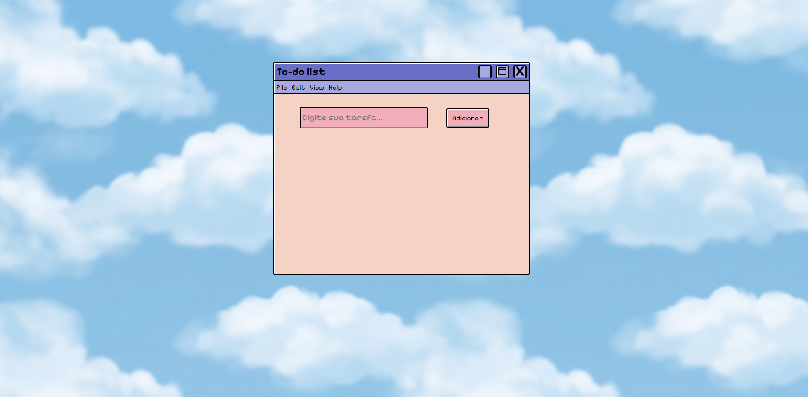

# ☁️ To-do List 

Uma aplicação de lista de tarefas inspirada na estética dos anos 2000 e interfaces clássicas do Windows.

## ✨ Sobre o projeto

Este projeto foi desenvolvido para praticar conceitos de Front-End utilizando HTML, CSS e JavaScript, criando uma interface nostálgica inspirada em sistemas operacionais antigos e no visual Y2K.

A proposta foi unir funcionalidade com uma estética retrô, utilizando:
- janelas estilo Windows clássico
- cores suaves e pastel
- bordas pixeladas
- tipografia vintage
- background com nuvens

## 🖥️ Preview

  
  
  

## 🚀 Funcionalidades

- Adicionar tarefas
- Interface responsiva
- Estética retrô/Y2K
- Layout inspirado em softwares antigos

## 🛠️ Tecnologias utilizadas

- HTML5
- CSS3
- JavaScript

## 🎨 Inspirações

- Windows 95/98
- Cultura Y2K
- Interfaces antigas de desktop
- Web design retrô

## 📚 Objetivo

Esse projeto foi criado com foco em estudos e prática de desenvolvimento front-end, especialmente estilização com CSS e construção de interfaces criativas.

---
